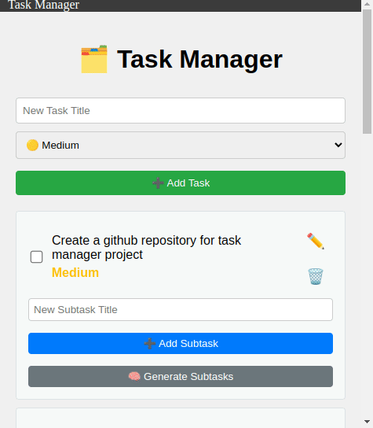

# Task Manager

Elevate your productivity with the Task Manager. Start managing your tasks efficiently today!

<p align="center">
  
</p>

## Overview

Welcome to the Task Manager, a powerful and intuitive tool designed to help you organize and manage your tasks effortlessly. This multi-platform application allows users to add, edit, delete tasks, and create subtasks (including nested subtasks) using AI assistance, ensuring that you stay productive and focused on what truly matters.

## Features

- **Multi-Platform Support**: Use it on any device, anywhere.
- **Add Tasks**: Quickly create tasks to manage your daily activities.
- **AI-Generated Subtasks**: Leverage artificial intelligence to auto-generate subtasks, saving you time and effort.
- **Nested Subtasks**: Create subtasks from existing subtasks for enhanced organization.
- **Drag and Drop**: Easily rearrange tasks with drag-and-drop functionality.
- **Edit & Delete Tasks**: Modify or remove tasks as needed.
- **User-Friendly Interface**: Designed with usability in mind, ensuring an enjoyable experience.

## Installation

To get started with your own instance of the Task Manager, simply clone the repository and install the dependencies:

```bash
git clone https://github.com/yourusername/task-manager.git
cd task-manager
npm install
```

## Usage

1. **Run the Application**:
   ```bash
   ng serve
   ```
   
2. **Access the Application**: Open your browser and navigate to `http://localhost:4200`.

3. **Add Tasks**: Enter a title for your task, select its priority, and click **Add Task**.

4. **Generate Subtasks**: Use the AI feature to create subtasks by clicking **Generate Subtasks**.

5. **Create Nested Subtasks**: Add subtasks to existing subtasks for better structuring.

6. **Edit and Delete Tasks**: Easily modify or remove tasks and subtasks.

## Technologies Used

- **Angular**: For building the user interface.
- **IndexedDB**: For local storage of tasks and subtasks.
- **RxJS**: For reactive programming with observables.
- **OpenAI**: For generating subtasks using AI capabilities.
  
## Contributing

We welcome contributions! If you have suggestions or improvements, please fork the repository and create a pull request.

## License

This project is licensed under the MIT License. See the LICENSE file for details.
